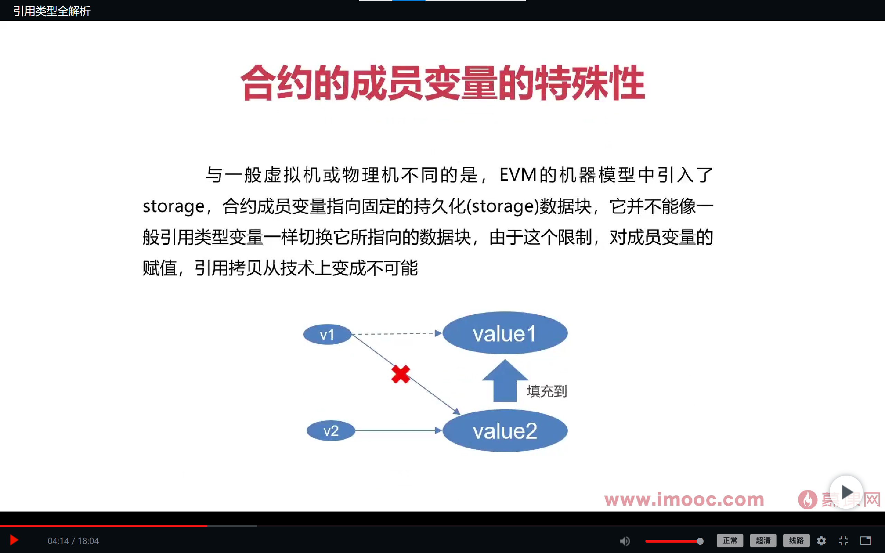
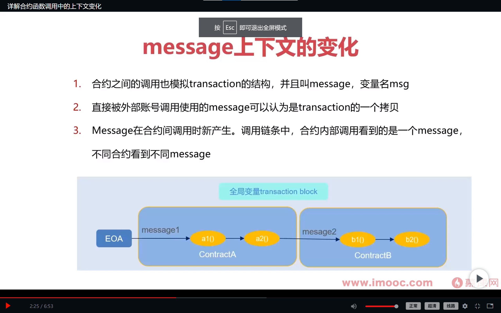
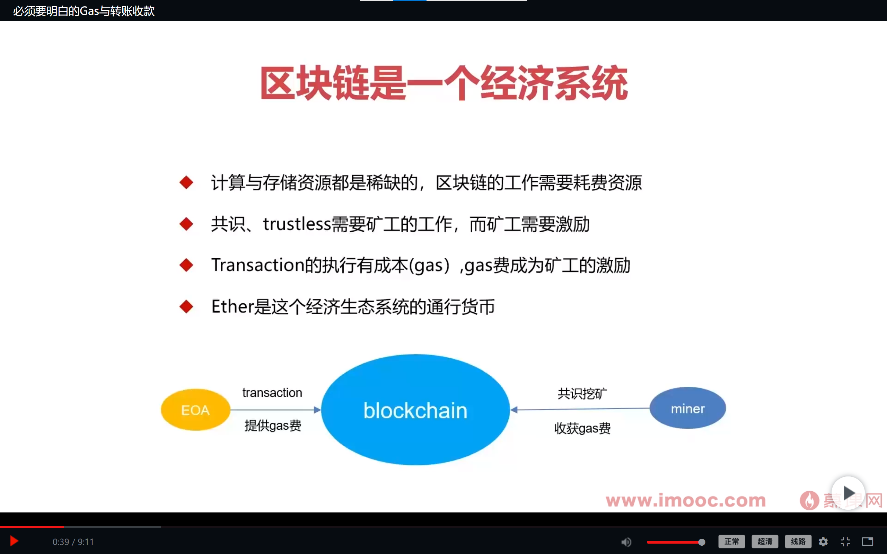
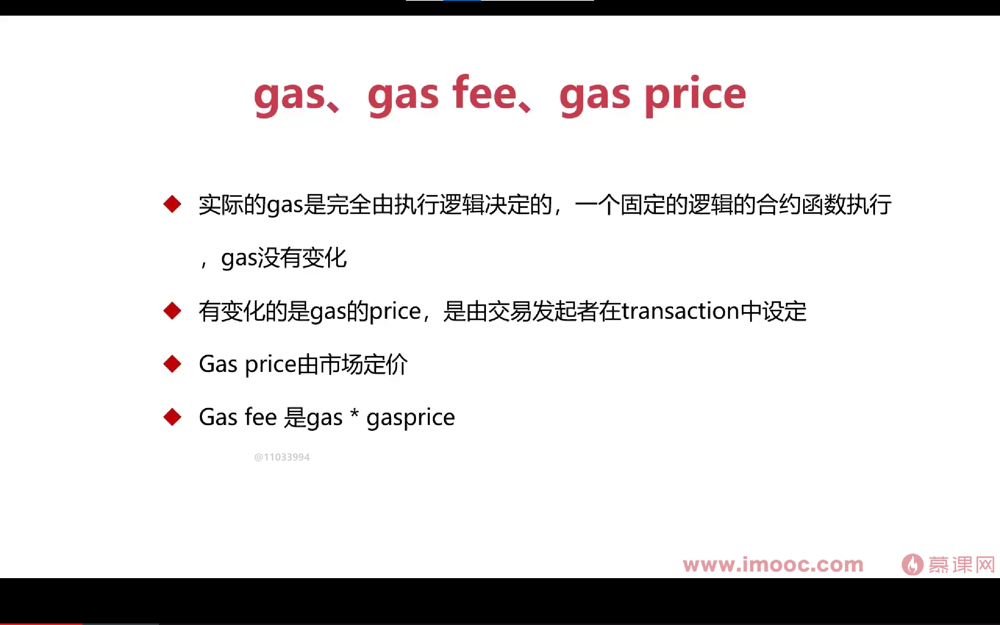
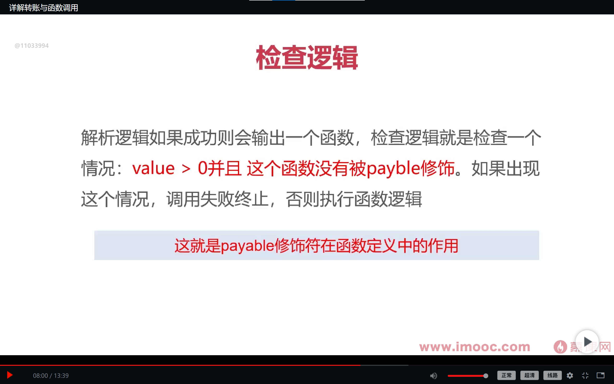
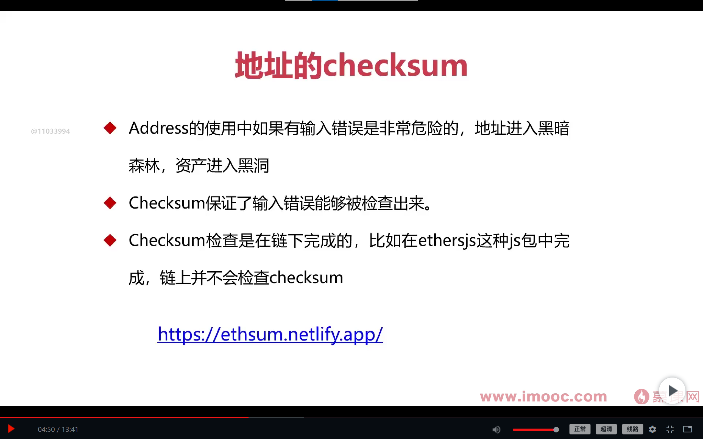
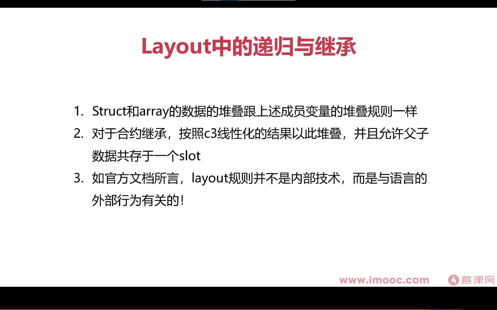
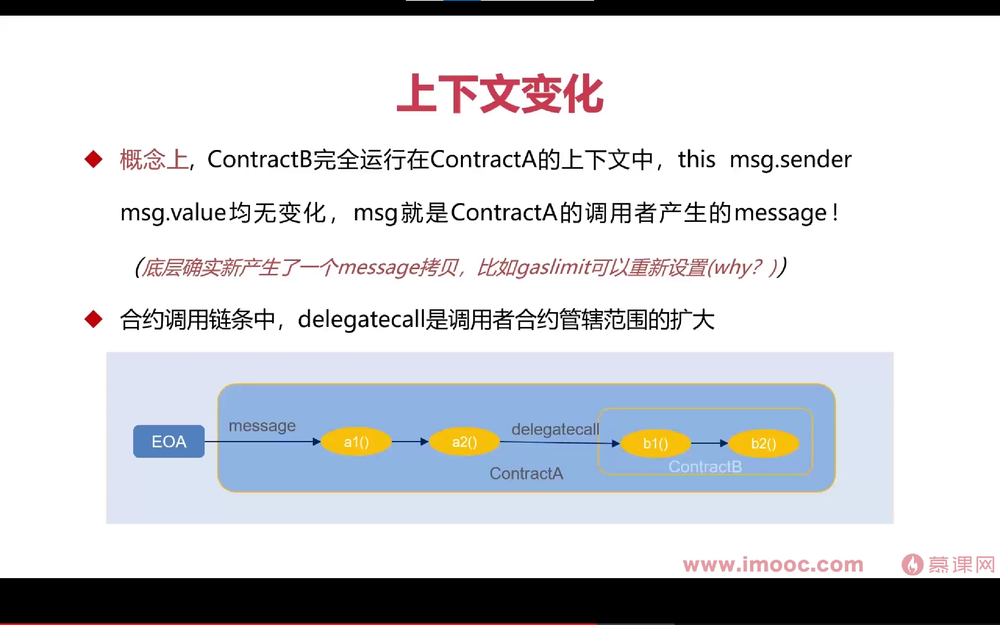

# 智能合约 solidity 语言深度学习：

## EVM 基本结构


特殊点：基于堆栈 持久化 storage gas 机制 与硬件无关

## EVM

EVM 是以太坊区块链上的虚拟机，负责执行智能合约的字节码。它使用堆栈架构、基于消息模型、持久化状态、Gas 机制等特性
EVM（Ethereum Virtual Machine）是以太坊的虚拟机，它是基于堆栈的虚拟机，用于执行以太坊智能合约的字节码。

以下是对 EVM 虚拟机的详细解释：

1. **堆栈架构**：EVM 是基于堆栈的虚拟机，**它使用堆栈（Stack）来管理数据**。所有的操作都是通过堆栈上的元素进行的，这种架构使得 EVM 的指令集非常简单和高效。

2. 字节码执行：以太坊智能合约的源代码经过编译器编译后得到字节码（Bytecode），这些字节码会在 EVM 上执行。EVM 的指令集是基于字节码的，每个指令都对应一个操作，例如加法、乘法、条件判断等。

3. 消息模型：EVM 是基于消息模型的虚拟机。智能合约可以接收来自外部账户的消息，并根据消息执行相应的操作。消息可以包含调用合约的数据、以太币的转账、以及其他附加信息。

4. **持久化状态**：EVM 通过状态数据库（State Database）来持久化存储智能合约的状态。每个账户在状态数据库中有一个对应的状态条目，包含了账户的余额、代码、存储数据等信息。当合约执行时，状态会被修改和更新。

5. 治理和共识：EVM 是以太坊区块链的核心组件之一。以太坊社区通过共识算法（目前是 PoW 或 PoS）来决定合约的执行结果和状态变更，确保网络中的所有节点在执行相同的字节码时达成一致结果。

6. **Gas 机制**：EVM 引入了 Gas 机制来控制合约的执行成本和避免无限循环等问题。每个操作都会消耗一定的 Gas，而合约的调用者需要支付相应的 Gas 费用。如果 Gas 不足以执行完合约的所有操作，合约的执行会被中断。

7. **EVM 与硬件无关**：EVM 的设计目标是与硬件平台无关，它提供了一个统一的虚拟机环境，使得智能合约可以在不同的计算平台上运行，确保合约在所有节点上都可以获得相同的结果。

## 智能合约根本性质

智能合约的本质就是一种表达 商业 && 法律 关系的契约， 在不同的领域有不同的表现，但本质上离不开 约束 的问题，不管是个人或是组织。这也就代表了，智能合约要具有一致性 稳定性 可执行性 要达到共识并且不可随意修改。一份不被认可的智能合约，就单单只是一份代码，并没有什么意义。所以不要只关注代码，更要去思考 一份智能合约 背后的意义 合约作者想要达到的效果或者说达到的目的。

## 运行机制

智能合约的运行，是不同于我们平常学习的语言中所见的一些虚拟机的。

### 交易驱动 && 无并发

智能合约是运行在比较特殊的虚拟机之上，(以以太坊为例)，智能合约运行在 EVM 之上，由区块链上的交易驱动。交易前后有序(上一个交易被确认打包之后才，下一个交易才能被广播确认，这是区块链的通识)，所以智能合约的运行机制没有并发问题。

### 交易的原子性

EVM 是由交易驱动，而每一个交易的执行只会有两种情况，要么成功要么失败。交易执行一旦失败就会回滚，所引起的状态改变就会抹掉，回到交易之前的状态，就像没有执行过这个交易一样，区块链的状态也就不会被改变。这就是交易的原子性。

这也就代表了，你所写的智能合约的函数包含多个操作时，如果其中任何一个操作失败，整个函数将被回滚，所有操作都将被取消，以保持数据的一致性。这确保了交易的原子性，即要么所有操作都成功，要么所有操作都不执行。

## 合约实例

智能合约被部署到区块链之后，就成为了一个之恩那个合约实例，而实例的标识就是得到的哈希值，也就是智能合约地址。通过这个标识（address）你就合约获取合约，引用合约，使用合约函数。

## 智能合约基础

### 成员变量

概念：储存合约状态的变量，可见性默认是 internal；

可见性：即对谁可见，谁能访问

三个维度：合约外部，本合约，子合约

public：完全可见 ；并且会为此变量生成一个 view 函数，或者说一个 getter 函数，用来读取此变量的值。这个问题可以在部署合约生成的 ABI 中看到。
private：本合约可见，其他不可见；
internal：对继承子合约可见；

### 函数定义方法

function fnName(参数) 可见性 交易相关 resturns(返回值){...}

1. 函数签名 ： fnName(参数)
2. 返回值: returns（返回值）
3. 修饰：可见性 && 交易相关

#### 函数可见性

默认值：早些版本是默认 public 。 现版本已经取消默认可见性的问题，必须为函数设置可见性。

可见性：public private internal external

#### 函数的交易属性

view ：合约状态读操作，即引用成员变量但不改变变量。

pure：与合约状态无关的函数

默认是写操作：写操作会发送像区块链发送一个交易，改变区块链状态。需要通过全网广播，公式确认。

### Event

在智能合约中，"event"（事件）是一种用于记录和通知合约中发生的重要动作或状态变化的机制。通过定义事件，合约可以在特定条件满足时触发事件并将相关信息广播给区块链网络的其他参与者。

事件可以被视为合约与外部世界之间的通信机制。当合约中的某个关键操作发生时，可以通过触发事件来向外部应用程序或用户提供通知。事件通常包含一些参数或数据，以便在事件触发时传递相关信息。

定义一个事件需要指定事件的名称、参数类型和顺序。

```

contract MyContract {

   event MyEvent(address indexed _user, uint256 _amount);

function doSomething() public {

    // 执行某些操作

   // 触发事件

     emit MyEvent(msg.sender, 100);

  } }

```

在上面的示例中，MyEvent 是一个事件，它包含两个参数：一个是地址类型的 \_user，另一个是无符号整数类型的 \_amount。doSomething 函数中的操作会触发事件，并通过 emit 关键字将事件广播出去。

通过监听合约事件，外部应用程序或用户可以实时获取合约中发生的重要动作或状态变化的信息，从而进行相应的处理或响应。

需要注意的是，事件本身并不改变合约的状态或执行任何特定的操作，它只是一种用于通知的机制。事件的数据会被记录在区块链上，以便其他参与者可以检索和使用。

#### 获取事件

外部应用程序或用户可以通过以下几种方式获取智能合约中触发的事件：

事件监听：外部应用程序可以通过监听智能合约中的事件来获取事件的通知。具体来说，应用程序可以订阅合约地址，并在合约地址上监听特定的事件。当事件被触发时，应用程序将接收到事件的数据。这可以通过区块链平台的提供的 API 或 Web3 库或 ethers 库来实现；

Web3.js

```

const Web3 = require('web3');

const web3 = new Web3('https://your-ethereum-node-url');
const contractAddress = '0x123456789...'; // 合约地址
const contractAbi = [...]; // 合约ABI
const contractInstance = new web3.eth.Contract(contractAbi, contractAddress);

contractInstance.events.MyEvent().on('data', event => {
      console.log('收到事件:', event.returnValues);
}) .on('error', error => {
    console.error('监听事件错误:', error);
});

```

Ethers.js

```

const { ethers } = require('ethers');

// 连接到以太坊网络
const provider = new ethers.providers.JsonRpcProvider('https://your-ethereum-node-url');
const contractAddress = '0x123456789...'; // 合约地址
const contractAbi = [...]; // 合约ABI

//创建合约实例
const contract = new ethers.Contract(contractAddress, contractAbi, provider);

//监听事件
contract.on(eventName, (eventArgs) => {
  console.log('收到事件:', eventArgs);
}).catch((error) => {
  console.error('监听事件错误:', error);
});

```

web3 与 ether 代码有所不同，但是逻辑一样，要获取合约实例，需要 provider address ABI。provider 是为了连接到合约所在网络。

### 函数修饰器

函数修饰器（Function Decorators）是一种在函数定义之前应用于函数的特殊语法，允许您在不修改原始函数代码的情况下，为函数添加额外的行为或功能。比较简单

智能合约的函数修饰器可以通过修改、包装或扩展函数的行为来实现各种目的，例如权限控制、事件记录、异常处理等

在 Solidity 中，使用函数修饰器时，_; 通常需要放在修饰器内部的最后，表示原函数体的位置。这是因为 _; 的作用是将控制流返回到原函数体中，如果放在修饰器内部的其他位置，将导致原函数体的执行提前结束或无法执行。

然而，从 Solidity 0.8.0 版本开始，引入了新的 modifier 功能，称为 modifier with statements，可以在修饰器内部的任意位置使用 _;。这意味着您可以在修饰器内部的不同位置使用多个 _;。

```

pragma solidity ^0.8.0;
contract MyContract {
    modifier myModifier() {

        // 在修饰器的不同位置使用多个 `_;`
        _; // 第一个 `_;`

        // 执行额外的逻辑
        _; // 第二个 `_;`

        // 执行其他逻辑
        _; // 第三个 `_;`
    }

    function myFunction() public myModifier {
        // 原函数体
    }
}

```

在上述示例中，myModifier 修饰器内部使用了多个 \_;，分别表示原函数体的位置。这样，修饰器可以在不同的位置添加额外的逻辑。

需要注意的是，modifier with statements 功能是在 Solidity 0.8.0 及更高版本引入的，如果您使用的是旧版本的 Solidity，则需要将 \_; 放在修饰器内部的最后位置。

### 数据类型

1. 值类型
2. 引用类型

#### 简述

值类型（Value Types）： 值类型表示直接存储数据值本身的数据类型。当将值类型赋值给新变量或作为参数传递时，将复制该值的副本。这意味着每个变量都有自己的独立值，对一个变量的修改不会影响其他变量。

引用类型（Reference Types）： 引用类型存储的是对数据的引用或指针，而不是直接存储数据本身。当将引用类型赋值给新变量或作为参数传递时，复制的是指向实际数据的引用，而不是数据本身。因此，多个变量可以引用和共享同一份数据。
下面是值类型和引用类型的一些区别：

1. 内存存储方式：

   值类型的数据直接存储在分配给变量的内存中。
   引用类型的变量存储的是对数据的引用或指针，实际数据存储在堆内存中。

2. 复制行为：

   值类型的复制是通过复制值本身进行的，每个变量都有独立的值。
   引用类型的复制只复制引用，多个变量可以引用同一份数据。

3. 修改行为：

   值类型的变量修改不会影响其他变量。
   引用类型的变量修改会影响其他引用同一份数据的变量。

4. 内存管理：

   值类型的内存管理由编译器或运行时环境自动处理。
   引用类型的内存管理通常由垃圾回收机制来自动释放不再使用的内存。

#### 值类型

### 数据类型

1.  值类型
    基本类型
    整型数 布尔 枚举
    特殊类型：
    contract address 定长字节数组
2.  引用类型

值类型（Value Types）： 值类型表示直接存储数据值本身的数据类型。当将值类型赋值给新变量或作为参数传递时，将复制该值的副本。这意味着每个变量都有自己的独立值，对一个变量的修改不会影响其他变量。

引用类型（Reference Types）： 引用类型存储的是对数据的引用或指针，而不是直接存储数据本身。当将引用类型赋值给新变量或作为参数传递时，复制的是指向实际数据的引用，而不是数据本身。因此，多个变量可以引用和共享同一份数据。

- 下面是值类型和引用类型的一些区别：

内存存储方式：

值类型的数据直接存储在分配给变量的内存中。
引用类型的变量存储的是对数据的引用或指针，实际数据存储在堆内存中。

复制行为：

值类型的复制是通过复制值本身进行的，每个变量都有独立的值。
引用类型的复制只复制引用，多个变量可以引用同一份数据。

修改行为：

值类型的变量修改不会影响其他变量。
引用类型的变量修改会影响其他引用同一份数据的变量。

内存管理：

值类型的内存管理由编译器或运行时环境自动处理。
引用类型的内存管理通常由垃圾回收机制来自动释放不再使用的内存。

### 值类型

#### 整数型（Integer）：

整数型（Integer）：表示整数值，可以是正数、负数或零。

1. Int/uint 以 8 位字节为增量递增，uint == uint256
2. 对于整形数类型 x，可以使用 type(x)min() && type(x).max()取最大值 && 最小值。
3. EVM 是 256 位的机器。
4. 整型数四则运算越界溢出：
   **注：低版本取模，高版本：抛出异常。**
   长度不同的两个整型数赋值

```
uint8 x = 8;
uint16 y = 16;
<!-- 互相赋值 -->
y = x; //这是可行的，因为y的长度大于x
x = y;//反之不可行
<!-- 强制转换 -->
x = uint8(y);//可行，但是数据的丢失要自己负责
```

#### 枚举型（Enumeration || Enum）：

枚举型（Enumeration || Enum）：表示一组命名的常量值，合约中的数据只能取这些预定义的值之一。

1.  枚举类型是用户自定义的一种数据类型。想使用枚举，就需要为枚举提前定义好内容。
    在示例中：DatOfWeek 是枚举类型，而 enum 关键字是为了声明此类型；
    也可以直接为其赋值，例:Monday=1;
    要注意第二个 get 函数的返回值 returns 是 DayOfWeek 类型

```
pragma solidity ^0.8.0;
     contract MyContract {
          // 定义枚举类型
            enum DayOfWeek {Monday, Tuesday, Wednesday, Thursday, Friday, Saturday, Sunday}
          // 声明枚举类型的变量
           DayOfWeek public currentDay;
          // 设置当前的星期几
        function setDay(uint day) public {
             require(day >= 0 && day <= 6, "Invalid day value");
             currentDay = DayOfWeek(day);
         }
         // 获取当前的星期几
    function getDay() public view returns (DayOfWeek) {
       return currentDay;
      }
   }
```

2.  可以与整形术显示转换(隐式不行)；
3.  枚举最少一个成员，最多 256 成员(uint8)，默认值为第一个成员
4.  整型到枚举的转换会检查是否越界

#### bool：

​ 布尔型（Boolean）：表示真（true）或假（false）的逻辑值。

#### ​address 类型：

前提：私钥产生公钥 公钥产生地址

1.  address 数据类型是 20 个字节的固定大小，并且存储在以太坊虚拟机（EVM）的存储器中。

2.  关于可支付：address payable：由成员函数 transfer 和 send。

    **address payable 可转换为 address，反之需要显示转换 payable(address)**

    balance 属性：address 类型的变量可以使用 balance 属性来获取该地址的账户余额，以 wei 为单位。

    transfer 函数：可以使用 address.transfer(value) 函数将以太币发送到指定地址，其中 value 是要发送的金额。

示例：

```

pragma solidity ^0.8.0;

contract MyContract {

    function getBalance(address account) public view returns (uint) {

        return account.balance;

    }

   function transferEther(address payable recipient) public payable {        recipient.transfer(msg.value);    }

}

```

1.  address 可转换为 uint160 和 bytes20

    4.合约地址与外部账号地址

2.  call balance 等

插入知识：

在 Solidity 中，有三种常见的方式可用于进行地址之间的转账操作：transfer、send 和 call。
对于不回滚的函数调用，我们要自己设置 if revert 语句 || require。去处理返回的 bool 值

1. transfer：

   - `address.transfer(value)` 是 Solidity 中 address 类型的内置函数，用于向指定地址发送以太币。

   - transfer 函数在发送以太币时会自动提供 2,300 gas，并且如果发送失败（如目标地址是一个合约并且无法接收以太币，合约既没有定义 receive 函数也没有定义 fallback 函数），则会抛出异常并回滚整个交易。**calldata 为空的 call 方法调用**

   - 当使用 transfer 进行转账时，如果转账失败，当前合约中的所有状态变化都会被撤销。

2. send：

   - `address.send(value)` 是 Solidity 中 address 类型的函数，用于向指定地址发送以太币。

   - send 函数在发送以太币时返回一个布尔值，表示转账是否成功。如果转账失败，它不会抛出异常，而是返回 false。

   - send 函数提供的 gas 限制较低，仅为 2,300 gas，因此当目标地址是一个复杂的合约时，可能无法执行所有的操作，可能导致转账失败。

   - 当使用 send 进行转账时，如果转账失败，当前合约中的所有状态变化都会被撤销。

3. call：

   - `address.call{value: amount}("")` 是 Solidity 中 address 类型的函数，用于向指定地址发送以太币，并调用目标地址的 fallback 函数（如果存在）。

   - call 函数提供了更灵活的选项，可以手动指定发送的金额（amount），并可以与目标地址交互进行更多的操作。

   - call 函数返回一个布尔值，表示转账是否成功。如果转账失败，它不会抛出异常，而是返回 false。

   - 当使用 call 进行转账时，如果转账失败，当前合约中的所有状态变化不会被撤销，但转账后的操作结果需要进行适当的处理。

总结：

- transfer 和 send 是较为简单的地址转账方式，但在处理复杂合约时可能有限制，并且会回滚状态变化。

- call 提供了更多的灵活性，但需要适当处理转账后的操作结果。

- 在进行地址转账时，确保提供足够的 gas 和处理转账失败的情况。在转账前，最好检查目标地址是否是一个可支付的地址（payable）。

- 在处理地址转账时，请确保注意转账金额、目标地址的合约逻辑和可能的异常情况，以确保转账操作的安全性和正确性。

#### contract 类型：

contract 类型表示合约类型，它用于定义和实例化智能合约。

1.  合约可以隐式转换为它的父合约

2.  合约可也 i 显示转换为 address 类型

3.  合约不支持任何的运算符

4.  从合约变量(实例)调用合约函数。（合约交互）

5.  合约可用 new 操作符部署另一合约 （合约交互）

#### 定长数组类型：

定长数组（Fixed-size Arrays）是一种固定长度的数组类型，它在声明时需要指定数组的长度，且长度不能更改。

1.范围：bytes1 到 bytes32

2.通过下标访问元素。(问题：是否能够修改)

3.通过 length 读取长度

`uint[5] public myArray;`

### 引用类型

1. 数组
2. Struct
3. mapping

#### 预备知识

##### Location 变量存储位置

EVM 访问数据是，是从三个地方访问数据：memory storage calldata

storage：使用 storage 关键字声明的变量将存储在合约的状态变量中。状态变量是永久存储在以太坊区块链上的数据。它们在合约的整个生命周期内都可以被访问和修改。

memory：使用 memory 关键字声明的变量将存储在临时内存中，只在函数执行期间存在。这些变量通常用于临时存储和处理函数的参数和局部变量。

calldata：使用 calldata 关键字声明的变量用于访问函数调用的输入数据（嵌入在 transaction 的数据字段）。calldata 中的数据是只读的，不能被修改。

默认情况下，函数参数和局部变量的存储位置是 memory，而状态变量的存储位置是 storage。

注：在函数参数中，memory 与 calldata 的区别，calldata 会直接指向调用函数的交易的一部分的数据字段，直接使用，交易数据肯定不可改的所以 calldata 就是只读的，不可更改。memory 会多做一些操作就是复制这个数据字段(calldata)，然后作为参数执行，也就需要更多的 gas，但也无关痛痒。

###### 交易数据字段

在以太坊中，每个交易（transaction）都包含一些特定的数据字段。以下是常见的交易数据字段：

1. `nonce`：交易发送者（发送交易的账户）的交易序号。它用于确保每个交易都有唯一的序号，防止重放攻击。

2. `gasPrice`：交易发送者愿意支付的每单位 gas 的价格。这决定了矿工愿意为打包和执行该交易所提供的报酬。

3. `gasLimit`：交易所允许使用的最大 gas 数量。这限制了交易执行的复杂性和成本，并确保在运行复杂或计算密集型操作时不会耗尽 gas。

4. `to`：接收交易的目标地址。对于合约创建交易，该字段可以为 null。

5. `value`：以太币（Ether）的数量，作为交易的价值。该字段用于在交易中传递货币或代币。

6. `data`：交易的附加数据字段。在普通以太坊交易中，这通常为空。对于调用合约的交易，该字段包含要执行的合约方法的参数。

7. `v`, `r`, `s`：交易的数字签名字段。它们用于验证交易的合法性和完整性，确保交易发送者的身份和数据的不可篡改性。

这些字段组合在一起形成一个完整的交易，并通过以太坊网络进行广播和验证。交易需要被矿工打包到区块中，并通过共识算法进行验证和确认。一旦交易被包含在区块中，它就成为不可变的记录，影响了账户余额和合约状态等数据。

#### 数组(array)

1. 两个 location 不同的数组，完全是两种不同的数据类型，应各自表述
   存储位置为 storage 的数组可以在函数之间传递，并且在函数之间保持状态。而存储位置为 memory 的数组必须作为函数参数或临时变量使用，并且在函数调用之间无法保持状态。
2. storage 和 memory 中的动态数组

   ```
   contract MyContract {
   <!-- storage -->
    uint[] public myArray;  // 声明一个公共的动态数组

    function addToArray(uint _value) public {
        myArray.push(_value);  // 修改合约存储空间中的数组数据  || pop
    }

    function getArrayLength() public view returns (uint) {
        return myArray.length;  // 直接访问合约存储空间中的数组长度
    }

   <!-- memory -->
    function processArray(uint[] memory _array) public pure returns (uint) {
    return _array.length;  // 访问内存中的数组长度
    }

   function example(uint size) public {
    <!-- 在内存中声明动态数组 这种声明方式是特定于memory数组的  并且没有push与pop  这两种方法是特定于storage数组的 -->
    <!-- 因为size可变你可以理解为动态，又因为数组被size定长你也可以理解为静态 定长数组 所以没有动态的push pop方法 -->
      uint[] memory myArray = new uint[](size);
      myArray[0] = 1;
      myArray[1] = 2;
      uint arrayLength = processArray(myArray); // 将内存中的数组传递给函数进行处理
      // 注意：在此之后，myArray 数组会被自动清除
     }
   }
   ```

3. 数组元素的类型限制

public 的公有函数，数组必须为 memory 不能为 storage。internal 可以为 storage。
原因:
public 修饰符的函数是合约的外部接口，可以被合约的外部调用者访问。为了保证安全性和合约的一致性，Solidity 不允许在 public 函数的返回值中使用 storage 修饰符。

使用 storage 修饰符返回引用类型的数组可以引入潜在的风险，因为外部调用者可以直接访问和修改合约存储空间中的数据。这可能导致意外的数据修改和不一致性。

为了遵循最佳实践和安全性原则，Solidity 在 public 函数的返回值中只允许使用 memory 修饰符来声明引用类型的数组。这样可以确保返回的数据是临时的副本，不会直接影响合约的存储状态。-->即 memory 拷贝的 原使用的数据 所以是副本

如果你想要在公共函数中返回数组并允许外部调用者访问，你可以将返回类型声明为 memory，然后在函数内部将数组的数据复制到临时的 memory 数组中并返回。

总之，这是 Solidity 语法的限制，旨在确保安全性和合约的一致性。因此，如果你需要在公共函数中返回数组，请使用 memory 修饰符来声明引用类型的数组，并在函数内部处理数据的复制和返回。--->internal 是对外部不可见的，所以不存在外部修改 storage 返回值的问题。

注：
需要注意的是，在 Solidity 中，数组是引用类型，存储在内存中。对数组的修改可能会产生 gas 成本，特别是当数组很大时。在处理大型数组时，应考虑使用映射（mapping）或其他数据结构来优化 gas 使用。

#### 结构(struct)

1. struct 如同 contract && enum 一样，用来自定义数据类型，struct 本身只是一个关键字，而自定义的内容才是 数据类型。
2. 状态变量。局部变量 参数 返回值均可用 struct
3. struct 可放在 mapping 和数组中，结构的成员可以是 mapping 或数组
   mapping 也可以为局部变量但是必须为 storage，也就是说每一个 mapping 都应该被永久储存。

#### mapping

1. 声明：mapping(key type => value type)
2. 用户自定义的复杂类型不能作为 key type 如：contract enum struct mapping
3. value type 可以是任何类型
4. 可以作为状态变量 （storage 的 局部变量 函数参数） 不能作为共有函数的参数和返回值--->mapping 只能是 storage 存储
5. public 的 mapping 会自动生成 getter;嵌套的 mapping 生成的 mapper 会有多个参数。（key type 作为函数参数，嵌套 mapping 就会有多个参数）
6. mapping 无法遍历 storage layout 相关

#### 重点

了解 solidity 的语言思想 storage memory
局部变量中的 storage 与 memory
了解语言背后的思想，什么情况下 不能用 storage 等等这些问题 都很简单

#### 字节数组 与 string

在 Solidity 中，字节数组（`bytes`）和字符串（`string`）都用于处理文本数据，但它们有一些不同之处。

1. 字节数组（`bytes`）：
   - 字节数组是一组原始字节的动态数组。
   - 字节数组的长度可以通过`.length`属性获取。
   - 字节数组可以通过索引访问和修改单个字节的值。
   - 可以使用`.push()`方法向字节数组末尾添加字节。
   - 字节数组可以通过`bytes`关键字声明。
   - 字节数组是可变长度的，可以动态调整大小。

示例：

```solidity
bytes memory myBytes = new bytes(5);  // 声明一个长度为5的字节数组
myBytes[0] = 0x61;  // 设置字节数组的第一个字节为ASCII字符'a'
myBytes[1] = 0x62;  // 设置字节数组的第二个字节为ASCII字符'b'
myBytes[2] = 0x63;  // 设置字节数组的第三个字节为ASCII字符'c'
myBytes.push(0x64);  // 将字节0x64添加到字节数组末尾
```

2. 字符串（`string`）：
   - 字符串是一组 Unicode 字符的动态数组。
   - 字符串的长度可以通过`.length`属性获取。
   - 字符串是不可变的，不能直接通过索引修改单个字符的值。
   - Solidity 提供了一些内置的字符串操作函数，如`concat`、`length`等。
   - 字符串可以使用`string`关键字声明。

示例：

```solidity
string memory myString = "Hello, World!";  // 声明一个字符串 || string memory myString = new string(5) 但是这种方式没有意义
uint stringLength = bytes(myString).length;  // 获取字符串的字节数
```

需要注意的是，字符串操作会消耗大量的气体（gas），特别是在循环中使用字符串操作时要特别小心。如果需要对字符串进行复杂的操作，建议使用字节数组进行处理，然后再转换回字符串。

另外，Solidity 提供了一些字符串操作的库，如`abi.encodePacked`、`abi.encodeWithSignature`等，可以对字符串进行编码和解码操作。

##### 强制转换 || 相互转换

在 Solidity 中，可以通过使用类型转换或库函数来进行字节数组（`bytes`）和字符串（`string`）之间的相互转换。

1. 字节数组到字符串的转换：
   - 可以使用`string`类型转换将字节数组转换为字符串。
   - 使用`abi.decode`库函数可以将字节数组解码为字符串。

示例：

```solidity
bytes memory myBytes = "Hello, World!";  // 字节数组
string memory myString = string(myBytes);  // 字节数组转换为字符串

// 或者使用 abi.decode 进行转换
string memory myString = abi.decode(myBytes, (string));
```

2. 字符串到字节数组的转换：
   - 使用`bytes`类型转换将字符串转换为字节数组。
   - 使用`abi.encode`库函数可以将字符串编码为字节数组。

示例：

```solidity
string memory myString = "Hello, World!";  // 字符串
bytes memory myBytes = bytes(myString);  // 字符串转换为字节数组

// 或者使用 abi.encode 进行转换
bytes memory myBytes = abi.encode(myString);
```

需要注意的是，字符串到字节数组的转换可能会导致编码和解码的开销，因此在处理大量文本数据时要注意性能和气体消耗。

另外，如果字符串包含 Unicode 字符，转换为字节数组时，每个 Unicode 字符将被编码为多个字节。

请确保在进行转换时，考虑到编码和解码的成本以及数据大小的限制。

### 引用类型全解析

在 solidity 语言中与通常的面向对象语言中的引用类型变量之间的赋值操作有所不同，solidity 的引用类型的变脸依然可能发生值拷贝。


#### 判定算法


这个很好理解，就是成员变量是不存在引用拷贝的，必定是值拷贝。给个函数示例就明白了。

```
contract MyContract {
    uint public a;
    uint public b;

    function copyValues() public {
        a = 10;
        b = a;  // 将a的值复制给b  这是值拷贝 而不是将一个指针指向b
    }
}

```

##### Location 对数据空间的分割

Location 限定的引用拷贝的范围.超出范围就成了值拷贝。


判定算法:编译器做的事


#### 检查算法

calldata 是只读的，意味着你不能在合约内部修改或拷贝 calldata 数据。

mapping： mapping 不支持遍历-->mapping 不能值拷贝。因为无法获取所有数据。 所以 mapping 的拷贝一定是引用拷贝

检查算法：这是编译器做的事


算法的作用：


对于开发者的应用，了解代码异常原因

### 合约结构

#### 合约上下文变量

之前说过 EVM 是由交易驱动的，任何合约函数的执行背后都是一个交易。对这个交易所承载的信息的读取和访问，必然是合约正确执行所需要的操作。上下文变量就是合约访问交易所承载的信息的 访问机制。

在 Solidity 中，合约上下文变量是指那些在整个合约中可访问的特殊变量。这些变量包括`msg`、`block`、`tx`等。它们提供了与区块链交互和访问交易信息的便捷方式。

下面是一些常见的合约上下文变量：

1. `msg`：包含当前交易的相关信息，如发送者地址(`msg.sender`)、交易发送者的余额(`msg.value`)等。

2. `block`：包含当前块的相关信息，如区块哈希(`blockhash`)、区块时间戳(`block.timestamp`)等。

3. `tx`：包含当前交易的相关信息，如交易哈希(`tx.hash`)、交易发送者地址(`tx.origin`)等。

4. `this`：引用当前合约实例本身。

这些合约上下文变量提供了与区块链交互和访问交易信息的便捷方式，使合约能够获取关键信息并做出相应的逻辑判断。

示例：

```solidity
contract MyContract {
    function getSenderAddress() public view returns (address) {
        return msg.sender;  // 获取当前交易的发送者地址
    }

    function getBlockTimestamp() public view returns (uint) {
        return block.timestamp;  // 获取当前区块的时间戳
    }

    function getTransactionHash() public view returns (bytes32) {
        return tx.hash;  // 获取当前交易的哈希值
    }
}
```

需要注意的是，合约上下文变量只在合约内部有效，不能在外部调用中直接访问或修改。它们提供了一种方便的方式来访问当前交易和区块的信息，并在合约中使用这些信息进行逻辑处理。

#### 上下文变量与交易的关系

上下文变量和交易之间存在联系，因为上下文变量提供了一种方便的方式来访问交易中的信息。尽管上下文变量的值并不直接从交易中获取，但它们提供了对交易信息的间接访问。

具体而言，上下文变量是在合约执行过程中由 Solidity 自动提供的，用于访问与当前交易或当前区块相关的信息。这些信息可以包括发送者地址、交易数据、区块时间戳等。

**当你在合约中使用上下文变量时，实际上是在间接访问交易中的信息。**在合约执行期间，Solidity 编译器和 Ethereum 节点会将相应的上下文变量设置为与当前交易和当前区块相关的值。

例如，`msg.sender` 是一个上下文变量，用于获取当前交易的发送者地址。当合约中访问 `msg.sender` 时，Solidity 编译器将其映射到当前交易的发送者地址，而不是直接从交易中提取该地址。

因此，上下文变量提供了一种简化和方便的方式来访问交易信息，而无需手动从交易中提取和解析。它们使得合约能够直接获取与交易相关的数据，并根据需要进行逻辑判断和操作。

总之，上下文变量和交易之间的联系在于上下文变量提供了对交易信息的访问方式，使合约能够轻松地获取与当前交易或当前区块相关的数据。虽然上下文变量的值并不直接从交易中获取，但它们通过提供对交易信息的间接访问，使得合约能够方便地使用交易信息来执行特定的逻辑和操作。

## 函数调用

### 合约之间调用(静态调用)

合约调用过程

1. 调用者必须持有被调用者合约的地址
2. 得到被调用合约的信息
3. 将地址重载为合约，调用它的函数

源文件内部：
源文件之间：
import 被调用合约的源文件
将被调用合约实例化
使用合约实例调用合约函数

### 通过接口进行调用

1. 合约接口等价于 ABI
2. 接口的定义方法
3. 接口的使用方法

#### ABI

ABI（Application Binary Interface）是一种用于合约之间通信的规范接口。它定义了合约如何与其他合约或外部应用程序进行交互，并描述了函数的输入参数、返回值、函数签名等信息。

Solidity 中的 ABI 可以用于以下目的：

合约间的函数调用：通过 ABI，你可以在合约中定义函数的接口，并根据这些接口在其他合约中调用相应的函数。

合约与外部应用程序的通信：通过 ABI，你可以定义合约与外部应用程序（如前端应用、其他智能合约等）之间的通信接口，使其能够相互交互。

交易数据的解析：ABI 也用于解析交易数据，从交易数据中提取函数调用信息，以便正确执行相应的函数。


#### interface

`interface` 是 Solidity 中的一个关键字，用于定义合约的接口。接口提供了一种约定，用于描述合约应该实现的函数接口，而不提供实现细节。

通过接口，你可以定义函数的名称、参数列表、返回类型和函数修饰符等，以及必要的事件和常量。接口中的函数不包含实际的函数体，只提供函数的声明。

接口主要用于以下情况：

1. **定义合约标准：接口可以作为一种标准，定义合约应该实现的函数接口。这样可以确保不同的合约遵循相同的规范。**

2. **实现合约组件：合约可以实现一个或多个接口，以满足其他合约对某些功能的需求。这样可以使合约之间的交互更灵活、可组合。**

**注意接口的函数是 external 的**
**如果合约继承了一个接口就要去实现接口中的函数，也就是上边说的规范性**

```solidity
interface MyInterface {
    function getValue() external view returns (uint);
    function setValue(uint _value) external;
    event ValueSet(uint indexed newValue);
}
```

在上述示例中，`MyInterface` 定义了两个函数 `getValue` 和 `setValue`，以及一个事件 `ValueSet`。这些函数和事件只有声明，没有实际的实现细节。

其他合约可以通过实现该接口来满足其所需的功能。

```solidity
contract MyContract is MyInterface {
    uint public value;

    function getValue() external view returns (uint) {
        return value;
    }

    function setValue(uint _value) external {
        value = _value;
        emit ValueSet(_value);
    }
}
```

在上述示例中，`MyContract` 合约实现了 `MyInterface` 接口，提供了接口中定义的函数的具体实现。

接口在 Solidity 中是一种重要的工具，可以提高合约的可组合性和可互操作性。它们允许不同的合约在接口约定下进行交互，并使代码更易于维护和理解。

##### 接口最小化：

即只包含必要的函数和事件，以实现特定的功能和交互。
通过最小化接口，可以减少合约之间的耦合性，并提供更清晰、更专注的功能接口。这样可以提高合约的可维护性、可重用性和可测试性

##### 合约之间的交互并不要求调用者使用特定的语法来实现一个接口。

Solidity 中的接口主要用于定义合约的函数接口，并提供一种约定，使不同的合约可以按照相同的接口规范进行交互。

接口本身并不会强制要求合约实现特定的函数，而是提供了一种约束和契约的机制。如果一个合约想要与某个接口进行交互，它只需要提供满足该接口定义的函数即可，而不需要使用特定的语法来实现接口。

例如，以下是一个最小化接口的示例：

```solidity
interface MyInterface {
    function getValue() external view returns (uint);
}
```

其他合约可以选择性地实现这个接口，只需要提供一个满足 `getValue` 函数的实现即可：

```solidity
contract MyContract {
    uint public value;

    function getValue() public view returns (uint) {
        return value;
    }
}
```

在上述示例中，`MyContract` 合约并没有使用特定的语法来实现接口 `MyInterface`（如 is 继承语法），而是根据接口定义提供了满足 `getValue` 函数的实现。这样，`MyContract` 合约就可以被认为是实现了 `MyInterface` 接口。

当其他合约或外部应用程序想要与 `MyContract` 合约进行交互时，它们只需要使用接口名称和合约地址进行交互，而不需要了解具体的实现细节。这样，接口提供了一种规范和契约，使得不同的合约可以按照相同的接口规范进行交互，提高了合约之间的互操作性和灵活性。

### 合约上下文变化

这就讲到到了之前的复习：上下文变量是间接访问 transaction 获取区块链交易相关交互信息。其实这种形式更像是一种映射关系。


解释：
这段描述指的是在以太坊上进行的一系列交易调用链条（transaction chain）中，任何一个环节的函数都可以访问整个调用链条的头部即发起者（origin）的交易。

当你在以太坊上发起一个交易时，这个交易可以触发合约函数的执行。而在合约中，又可以通过调用其他合约的函数来形成一个更长的交易调用链条。

在这个调用链条中，每个交易都有一个发起者（origin），即最初发起整个调用链条的交易。发起者的交易可以携带一些信息和授权，如签名等。

根据这段描述，无论这个调用链条有多长，任何一个环节的函数都可以访问整个调用链条的头部即发起者 transaction。这意味着每个环节都可以通过特定的上下文变量（如`tx`）来访问发起者交易的信息，包括发起者的地址、交易数据、签名等。

通过访问发起者 transaction，每个环节的函数可以了解调用链条的起始点，以及相关的授权和上下文信息。这为合约之间的复杂交互和多层调用提供了一种机制，使得合约能够根据整个调用链条的信息来进行逻辑判断和操作。

需要注意的是，对于一些特定的上下文变量，如`tx.origin`，虽然可以访问发起者的地址，但在某些情况下可能存在安全风险，因此需要谨慎使用并进行适当的验证和控制。

transaction 又来自一个 block，对应的上线问变量名 block。这就像我们说的映射关系。

#### msg 的变化


这样也更合理，比如一个合约调用另一个合约；那么后被调用合约访问 msg.sender 就是调用合约的地址。

总结：在调用链条中，每个合约函数看到的 tx block 是唯一的(block 与交易的映射关系)。而 msg 会随着调用者的变化而变化。

#### external

1. external **应该**只被外部调用。也就是 external 只是一种建议，合约作者希望这个函数被外部调用。不建议在本合约另一个函数被进行此函数的调用。
2. 可以被内部调用，但是会产生新的 msg; 内部调用 msg.sender 就成了合约地址

### 函数动态调用

#### call

**call 异常不会终止函数的执行**


selector 函数选择器，
可以看下边的 call 基本语法里的 abi.encodeWithSignature("functionName(uint256)") 这就是 calldata
详解：
在 Solidity 中，`call` 方法用于在合约之间进行函数调用和交互。它是一种低级调用方法，可以与任何合约进行交互，包括智能合约和外部合约。

`call` 方法的基本语法如下：

```solidity
(bool success, bytes memory data) = address(targetContract).call{value: amount}(abi.encodeWithSignature("functionName(uint256)", param));
<!-- 函数返回值bytes data，需要解码 abi.decode(data) -->
```

下面是对 `call` 方法的各个部分的详细解释：

1. `address(targetContract)`: 这是一个合约地址，表示要调用的目标合约的地址。

2. `.call{value: amount}(...)`: 这是一个调用语法，用于指定调用的价值（value）。在花费以太币的情况下，可以使用这个语法将以太币发送到目标合约。`amount` 是以太币的数量。

3. `abi.encodeWithSignature("functionName(uint256)", param)`: 这是一个用于编码函数签名和参数的方法。你需要提供要调用的函数名称、参数类型和参数值。在示例中，我们使用 `encodeWithSignature` 方法，指定函数名为 "functionName"，参数类型为 `uint256`，并传递一个参数 `param`。

4. `(bool success, bytes memory data)`: 这是对 `call` 方法的返回值的定义。`success` 是一个布尔值，表示函数调用是否成功。`data` 是一个字节数组，用于存储返回的数据。

使用 `call` 方法进行合约调用时，需要注意以下几点：

- 调用可能失败：调用合约时可能会失败，例如由于合约抛出异常、调用超时等。因此，在使用 `call` 方法后应该检查 `success` 的值来确保调用成功。

- Gas 和价值：在使用 `call` 方法时，你可以指定调用所需的 gas 和发送的以太币价值。gas 是调用函数时使用的燃料量，而以太币价值是在交易中发送的以太币数量。如果你不需要发送以太币或指定特定的 gas，可以省略这部分。

- 返回数据的处理：`call` 方法的返回值中的 `data` 是一个字节数组，你需要根据目标函数的返回类型来正确处理这些返回数据。

需要注意的是，`call` 方法是一种低级调用方法，需要手动处理返回值、异常和安全性等方面的考虑。在 Solidity 中，还有其他更高级的方式来与合约进行交互，如使用接口（interface）来定义函数接口并进行类型安全的调用。这些方法可以提供更便捷和安全的合约交互机制。

##### abi 工具


`abi.encode` 和 `abi.decode` 是 Solidity 中用于编码和解码数据的函数，用于处理合约间的数据传输和交互。

- `abi.encode`：它是一个编码函数，用于将参数按照指定的类型编码为字节数组（byte array）。它的语法为：

  ```solidity
  function abi.encode(type1 param1, type2 param2, ...) returns (bytes memory)
  ```

  示例：

  ```solidity
  bytes memory encodedData = abi.encode(uint256(10), "Hello");
  ```

  在上述示例中，`abi.encode` 将一个 `uint256` 类型的参数和一个字符串参数编码为一个字节数组 `encodedData`。

- `abi.decode`：它是一个解码函数，用于从字节数组中解码数据，并按照指定的类型进行解析。它的语法为：

  ```solidity
  function abi.decode(bytes memory data, (type1, type2, ...)) returns (type1, type2, ...)
  ```

  示例：

  ```solidity
  bytes memory data = abi.encode(uint256(10), "Hello");
  (uint256 number, string memory greeting) = abi.decode(data, (uint256, string));
  ```

  在上述示例中，`abi.decode` 将字节数组 `data` 解码为一个 `uint256` 类型的变量 `number` 和一个字符串变量 `greeting`。

使用 `abi.encode` 和 `abi.decode` 可以方便地在合约之间传输和解析复杂的数据类型，如结构体、数组和动态数组等。它们提供了一种标准化的数据编码和解码方式，确保数据在不同合约之间的正确传输和解析。

**需要注意的是，编码和解码的类型参数需要与实际数据类型相匹配，否则可能导致编码和解码错误。在使用 `abi.decode` 时，确保提供正确的类型顺序以正确解析数据。**

#### fallbcak(回退 || 备胎函数) && receivers

在 Solidity 中，`fallback` 和 `receive` 是两个特殊的函数，用于处理合约接收以太币的情况。
fallback 函数实在函数选择器不能定位到一个相应函数是使用的，所以叫备胎，没人干的活备胎干。


1. `fallback` 函数：

   - `fallback` 函数是合约中的一个特殊函数，当合约接收到以太币或调用未知函数时触发执行。
   - 在较早的 Solidity 版本中，`fallback` 函数没有参数和返回值，它用于接收以太币和执行默认逻辑。
   - 从 Solidity 0.6.0 版本开始，`fallback` 函数被拆分为两个：`fallback` 和 `fallback() payable`。
   - `fallback` 函数是不可支付（non-payable）的，不接受以太币发送。
   - 如果合约定义了 `fallback` 函数，但没有定义可支付的 `fallback` 函数，则在调用未知函数或尝试向合约发送以太币时会触发 `fallback` 函数的执行。

2. `receive` 函数：
   - `receive` 函数是 Solidity 0.6.0 版本引入的一个特殊函数，用于接收以太币。
   - `receive` 函数是可支付（payable）的，它用于接收合约地址直接发送的以太币。
   - 一个合约只能有一个 `receive` 函数，且没有参数和返回值。
   - 当以太币直接发送到合约地址时，会触发 `receive` 函数的执行。

示例：

```solidity
contract MyContract {
    receive() external payable {
        // 处理接收到的以太币
    }

    fallback() external {
        // 默认逻辑，当调用未知函数时触发执行
    }

    fallback() external payable {
        // 可支付的 fallback 函数，当以太币发送到合约时触发执行
    }
}
```

在上述示例中，`receive` 函数用于接收以太币，并在接收到以太币时触发执行。`fallback` 函数可以处理调用未知函数或以太币发送到合约的情况，其中可支付的 `fallback` 函数可以处理接收以太币的逻辑。

需要注意的是，从 Solidity 0.8.0 版本开始，合约不再需要显式定义空的 `receive` 函数来接收以太币，而是默认具有可支付的 `fallback` 函数。因此，在新的 Solidity 版本中，可以使用 `fallback` 函数来处理接收以太币的逻辑。

### Gas 相关问题

这就没什么说的，很浅显的问题，关于区块链上的经济学问题或者说管理学问题。就是给干活的人发工资，没钱没人干活。


gas 是逻辑执行
gas price 就是 gas 单价

gaslimit && gasLeft()


### 转账相关

理解转账的关键是理解合约收款的设计安排，转账是函数调用的伴生。
把合约收款设计分成两个步骤：被调用函数解析逻辑和检查逻辑。

1. receive()
   

2. 收款方过滤器链条结构
   
3. 
4. 
5. 转账发起者
   **个人理解，转账操作中，合约或者说合约函数就像是一个中介，当有函数调用并且带了一笔钱，执行检查算法，如果通过这比钱就先到了合约里，合约的上下文变量是可以访问这个值的 msg.value。函数体里有 transfer 等的转账方法，就可以将合约的钱(相应的 value)转到相应的地址**

### 插入知识 selfdestruct

在以太坊上，合约销毁（contract destruction）是指从区块链中永久删除合约及其状态的操作。合约销毁后，合约的代码、存储数据和合约地址都将被彻底移除，不再存在于区块链上。

合约销毁通常是由合约的创建者或合约本身的某个函数触发的，通过一些特定的操作来执行。下面是一种常见的合约销毁模式：

```solidity
contract MyContract {
    address payable owner;

    constructor() {
        owner = payable(msg.sender);
    }

    function destroy() public {
        require(msg.sender == owner, "Only owner can destroy the contract");
        selfdestruct(owner);
    }
}
```

在上述示例中，合约的创建者被保存在 `owner` 变量中。`destroy` 函数可以被合约的创建者调用，它首先使用 `require` 条件来验证调用者是否是合约的创建者，然后使用 `selfdestruct` 函数将合约销毁，并将合约余额发送给 `owner` 地址。

需要注意的是，一旦合约被销毁，它的代码和存储数据将永久丢失，并且无法撤销。因此，在执行合约销毁操作之前，务必确保没有重要的数据或资产存在于合约中，并且确保只有授权的地址可以触发销毁操作。

合约销毁是一种有限制和慎重使用的操作，需要仔细考虑和谨慎执行。它通常用于合约的终止、合约升级、资金退回等情况。在执行合约销毁之前，建议先进行充分的测试和验证，确保操作的安全性和正确性。
`selfdestruct` 是 Solidity 中用于销毁合约的特殊函数。

#### selfdestruct 语法

`selfdestruct` 函数的作用是将合约销毁，并将合约余额发送到指定的地址。它的语法如下：

```solidity
selfdestruct(address payable recipient);
```

- `recipient` 参数是一个可支付地址，指定了销毁合约后合约余额要发送到的目标地址。

当调用 `selfdestruct` 函数时，合约将被永久销毁，合约的代码、存储数据和合约地址都将从区块链中删除。合约的余额会被发送到指定的 `recipient` 地址。

需要注意的是，`selfdestruct` 函数只能由合约本身调用，不能由其他合约或外部账户调用。在执行 `selfdestruct` 之前，合约的所有存储变量和状态将被清除，不能再被访问。

需要注意的是，销毁合约后，合约的地址和代码将不再存在于区块链上，无法再访问合约的任何函数或数据。因此，在执行 `selfdestruct` 操作之前，请确保你理解操作的后果，并做好充分的测试和验证。

### 函数调用的边界性问题

形式符合的一个字符串(160 位数据块地址)，黑洞；可进不可出

checksum


### 思考

思考：怎样通过 data 向一个 EOA 发文本消息？

## 合约调用难点 delegatecall 与代理模式

链接关系
delegatecall 是 library 和代理模式的技术基础，库函数某种度上也是一种代理模式。


### 知识前提 storage layout


存储布局（storage layout）是指 Solidity 合约中状态变量在存储中的排列方式和分配方式。它决定了合约中不同状态变量的存储位置和访问方式。

在 Solidity 中，合约的状态变量可以分为值类型（value types）和引用类型（reference types）两类。值类型变量直接存储在合约的存储区域，而引用类型变量存储在存储区域中的一个指针，实际数据存储在外部。

以下是 Solidity 的一些存储布局规则：

1. 值类型变量：布尔类型、整数类型、浮点数类型、地址类型等都是值类型变量，它们直接存储在合约的 storage 区域中。值类型变量的存储位置由编译器自动决定，根据变量的定义顺序和大小进行分配。

2. 引用类型变量：引用类型变量包括数组、结构体和映射等。它们的存储布局更复杂，通常是存储在合约 storage 区域中的一个指针，实际数据存储在外部。引用类型变量的存储位置由编译器自动决定，但它们的指针会存储在合约的存储区域中。
3. 存储顺序：状态变量按照它们在合约中的声明顺序进行存储。先声明的变量存储在较低的存储位置，后声明的变量存储在较高的存储位置。

4. 存储分配：Solidity 使用最小化存储布局策略，尽可能节省存储空间。这意味着相邻的布尔类型和整数类型变量可能会被打包在同一个存储槽中，而不会占用额外的存储空间。
   
   
   需要注意的是，存储布局是由编译器决定的，具体实现可能因编译器版本、优化选项和合约的结构而有所差异。因此，在编写合约时，无法直接控制存储布局的细节。如果需要确定合约中特定状态变量的存储位置，可以通过 Solidity 的 `storage` 关键字和内联汇编语言来进行更精确的控制。

了解存储布局对于合约的优化和安全性都很重要。它可以影响合约的存储成本、读写操作的 gas 消耗以及避免存储冲突等问题。因此，在编写合约时应谨慎考虑状态变量的存储布局，合理规划合约的存储结构。
**重点**

**layout 中的递归**


### delegatcall

一个合约调用别的合约的代码，在自己合约中使用。就像是直接把一个函数及相关变量写入自己的合约；储存布局不同，会乱套。
delegatecall 中，被调用者又通过 call 调用了自己的函数？不允许，会造成上下文的变化，如 msg.sender
理解:


#### 上下文变化



#### 详解

`delegatecall` 是 Solidity 中的一种特殊函数调用，它可以在一个合约中执行另一个合约的函数，同时保持调用上下文和状态。

使用 `delegatecall` 可以实现合约之间的委托调用，将一个合约的执行逻辑委托给另一个合约来执行。与普通的 `call` 或 `send` 不同，`delegatecall` 不会改变调用者的上下文，包括合约的存储状态、合约地址和消息发送者等。

`delegatecall` 的语法如下：
记得处理返回的 bool 值
注意与 fallback 的配合使用

```solidity
(bool success, bytes memory returnData) = targetContract.delegatecall(
    abi.encodeWithSignature("functionName(type1,arg1,type2,arg2,...)", arg1, arg2, ...)
);
<!-- msg.data--->calldata -->
(bool success, bytes memory returnData) = targetContract.delegatecall(msg.data);
```

- `targetContract` 是要执行函数的目标合约地址。
- `functionName` 是目标合约中要调用的函数名。
- `type1,arg1,type2,arg2,...` 是函数的参数类型和值。
- `success` 是一个布尔值，指示调用是否成功。
- `returnData` 是一个字节数组，包含调用函数的返回值。

需要注意的是，使用 `delegatecall` 进行合约调用时，目标合约的函数必须使用 `external` 可见性修饰符，并且不能有状态变量的修改操作。这是因为 `delegatecall` 执行的代码在调用合约的上下文中执行，包括存储和上下文变量。因此，如果目标合约中有修改状态的操作，它们将应用于调用合约的存储和上下文，而不是目标合约自身的存储和上下文。

`delegatecall` 的使用要谨慎，需要确保目标合约是可信的，并且对调用的函数参数进行正确的编码和解码。错误的使用 `delegatecall` 可能导致安全风险和意外的行为。

总之，`delegatecall` 提供了一种合约间代码复用和逻辑委托的机制，但需要谨慎使用，并且需要确保目标合约和调用参数的正确性。

### 代理模式

代理模式是用于解决合约升级问题的。
思考：我们说智能合约是一种锲约形式，不可随意更改的。那为什么还要一个合约升级机制那？这不就冲突了吗？
一方面：智能合约是**稳定**的，并不是说智能合约就该是永久**固定**的，也可能会有 改约 废约。
另一方面：每一份智能合约的代码并不是完美的，而且智能合约出现漏洞的话，又会带来严重的后果，但是上链之后就不可更改。如果合约有漏洞，受到攻击，怎么修复合约漏洞或者说是处理风险问题就成了一个紧急事件。合约代理模式(升级)，就留出了挽救的余地。

使用代理模式来实现权限控制。代理合约充当访问控制的中介角色，对外部调用进行权限验证，然后委托给目标合约执行具体的功能。

需要注意的是，代理模式在合约设计中需要慎重考虑，特别是对于存储的处理和状态维护。代理模式的使用可能增加了复杂性，并引入了额外的开销。因此，在选择和实现代理模式时，需要根据具体的需求和场景进行评估，并权衡其优势和劣势。

### 代理模式


delegatcall 与 fallback 函数的配合，达成了代理模式的基本工作机制。
**函数逻辑的 外交**


#### 升级

**好妙的思想！！！！:)**
保持数据不变情况下，对逻辑处理进行改变。


#### 示例

我们通过 updateTo 改变 logic 地址 实现 v1 到 v2 的升级


### 非结构化代理模式

暂时：先搁置。。。
需要用到汇编：因为要把数据的存储抛向远方；
proxy 就想当与以库，只需调用方法，而方法的实现逻辑与数据全在外部。数据存在远方，逻辑在另一个合约，只需设置一个接口将逻辑合约实例化，proxy 调用。


### 库合约

库合约相当于，合约内部调用，不会引起上下文变化


## 多重继承

1. 线性化问题
2. 函数覆盖

### 继承基础知识

1. 继承方法：is 关键字
2. 变量(无)与 函数,modifier,event 可见性(同意命名空间。会命名冲突)
3. 构造函数语法

#### 代码详解

在 Solidity 中，合约之间可以通过继承关系进行代码重用和扩展。当一个合约继承另一个合约时，子合约可以使用父合约的状态变量和函数。

以下是 Solidity 中继承关系中构造函数的语法：

1. 子合约可以通过 `is` 关键字继承父合约，并在子合约的定义中指定父合约的名称。

```solidity
contract ParentContract {
    uint256 public parentData;

    constructor(uint256 _data) {
        parentData = _data;
    }
}

contract ChildContract is ParentContract {
    constructor(uint256 _data) ParentContract(_data) {
        // 子合约构造函数可以调用父合约的构造函数
    }
}
```

在上述示例中，`ChildContract` 继承自 `ParentContract`。子合约的构造函数使用 `ParentContract(_data)` 来调用父合约的构造函数，并传递参数 `_data`。

2. 如果子合约没有显式定义构造函数，它将继承父合约的构造函数。

```solidity
contract ParentContract {
    uint256 public parentData;

    constructor(uint256 _data) {
        parentData = _data;
    }
}

contract ChildContract is ParentContract {
    // 子合约没有显式定义构造函数，将继承父合约的构造函数
}
```

在上述示例中，子合约 `ChildContract` 没有定义自己的构造函数，因此它会继承父合约 `ParentContract` 的构造函数。

需要注意的是，如果子合约显式定义了构造函数，那么它必须调用父合约的构造函数，并传递相应的参数。如果父合约的构造函数包含必要的参数，子合约必须通过调用父合约的构造函数来初始化父合约的状态变量。

通过继承构造函数，子合约可以继承父合约的初始化逻辑和状态变量，提供了一种方便的方式来扩展和定制合约的功能。

#### super 关键字

在 Solidity 中，`super` 是一个关键字，用于访问父合约的函数和状态变量。(处理命名冲突)

当一个合约继承另一个合约时，子合约可以使用 `super` 关键字来调用父合约的函数和访问父合约的状态变量。

以下是 `super` 关键字的使用示例：

```solidity
contract ParentContract {
    uint256 public parentData;

    function parentFunction() public {
        // 父合约的函数逻辑
    }
}

contract ChildContract is ParentContract {
    function childFunction() public {
        parentData = 42;  // 通过 super 关键字访问父合约的状态变量
        super.parentFunction();  // 通过 super 关键字调用父合约的函数
    }
}
```

在上述示例中，`ChildContract` 继承自 `ParentContract`。在 `childFunction` 函数中，使用 `super.parentData` 访问父合约的 `parentData` 状态变量，并使用 `super.parentFunction()` 调用父合约的 `parentFunction` 函数。

通过 `super` 关键字，子合约可以明确地引用和访问父合约的成员，避免命名冲突，并扩展和定制父合约的功能。

需要注意的是，只有在子合约中存在与父合约同名的函数或状态变量时，才需要使用 `super` 关键字来区分和引用父合约的成员。否则，可以直接访问或调用父合约的成员，而无需使用 `super` 关键字。

总之，`super` 关键字在 Solidity 中用于访问父合约的函数和状态变量，提供了一种机制来扩展和定制继承合约的功能，并在继承关系中处理命名冲突。

### 多态知识


#### abstract

在 Solidity 中，`abstract` 是一个关键字，用于声明一个合约或函数为抽象的。

1. 抽象合约：抽象合约是一种不能被实例化的合约，它仅用于定义接口和约定。抽象合约通常包含未实现的函数声明，这些函数需要在继承合约中进行实现。

```solidity
abstract contract MyAbstractContract {
    function myFunction() external virtual;
}
```

在上述示例中，`MyAbstractContract` 是一个抽象合约，它定义了一个名为 `myFunction` 的抽象函数。抽象函数没有实现，需要在继承合约中进行具体实现。

2. 抽象函数：抽象函数是一种在合约中声明但没有提供具体实现的函数。抽象函数必须存在于抽象合约中，并且必须在继承合约中被重写和实现。

```solidity
abstract contract MyAbstractContract {
    function myFunction() external virtual;
}

contract MyContract is MyAbstractContract {
    function myFunction() external override {
        // 实现抽象函数的具体逻辑
    }
}
```

在上述示例中，`MyContract` 继承自 `MyAbstractContract` 抽象合约，并重写了 `myFunction` 抽象函数来提供具体的实现。

抽象合约和抽象函数提供了一种机制来定义接口和共享约定，同时要求继承合约提供具体的实现。抽象合约可以作为接口的替代方案，用于约束合约的行为和功能。使用抽象关键字可以提高代码的可读性和可维护性，并帮助开发者遵循合约的约定和规范。

### c3 线性化(回退算法)


算法理解

算法描述


### 多重继承覆盖


代码简解：
Solidity 支持多重继承，允许一个合约从多个父合约继承。在多重继承的情况下，Solidity 使用一种类似于 C3 线性化算法的算法来确定函数调用的顺序，以解决潜在的冲突。

当一个合约从多个合约继承时，父合约在继承列表中的顺序是重要的。线性化算法确定了一种线性化的基础合约序列，定义了函数调用的顺序。

以下是 Solidity 中多重继承的示例：

```solidity
contract ParentA {
    function foo() public pure virtual returns (string memory) {
        return "ParentA";
    }
}

contract ParentB {
    function foo() public pure virtual returns (string memory) {
        return "ParentB";
    }
}

contract Child is ParentA, ParentB {
    function foo() public pure override(ParentA, ParentB) returns (string memory) {
        return super.foo();  // 调用 ParentA 的 foo() 函数
    }
}
```

在上面的示例中，`Child` 合约同时从 `ParentA` 和 `ParentB` 继承。由于两个父合约都有一个名为 `foo()` 的函数，`Child` 合约重写了该函数，并使用 `super` 关键字明确指定调用哪个父合约的 `foo()` 函数。

继承的顺序会影响函数的解析顺序。例如，如果 `Child` 定义为 `contract Child is ParentB, ParentA`，那么在 `Child` 中调用 `super.foo()` 将调用 `ParentB` 的 `foo()` 函数。

Solidity 中的线性化算法确定了多重继承情况下函数调用的一致和明确的顺序，确保函数的解析正确无误。

# 汇编入门

学习目标

1. 了解 EVM 基础知识
2. 能够读懂指令集文档
3. 开发内联汇编代码

## EVM 基本结构


## 内存布局

上一个复习的是 storage 布局
字节寻址 字长读写


##

汇编听不懂，没有汇编基础，什么时候明白什么时候在补充笔记
